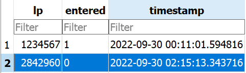

## Parking Lot Service

service which gets an image of an Israeli license plate and returns a decision whether a vehicle may enter the parking
lot. Each decision is written to a local database together with the License Plate number and Timestamp.

the decision should be determined by the following rules:

* Public transportation vehicles may enter the parking lot (their license plates always end
with 25 or 26).
* Digits number whose two last digits are 85/86/87/88/89/00, should not enter.
* If the license plate number consists of 7 digits, and ends with 0 or 5, he cannot enter.

## Main.py:
1. get_vehicle_decision
2. Write the decision to a local database together with the License Plate and Timestamp.

## Files:
* main.py
* license_plates.py
* json_handler
* database.py
* 14-807-86.jpg
* 28-425-60.jpg
* 123-45-678.jpg

# DB:
The service will automatically create the parking_lot table:
    
e.g.

